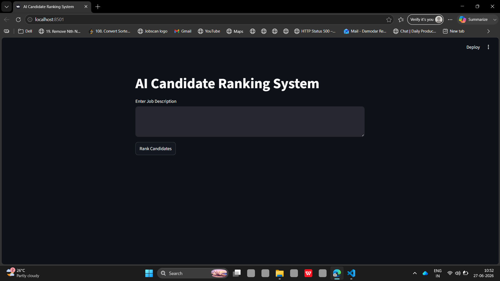
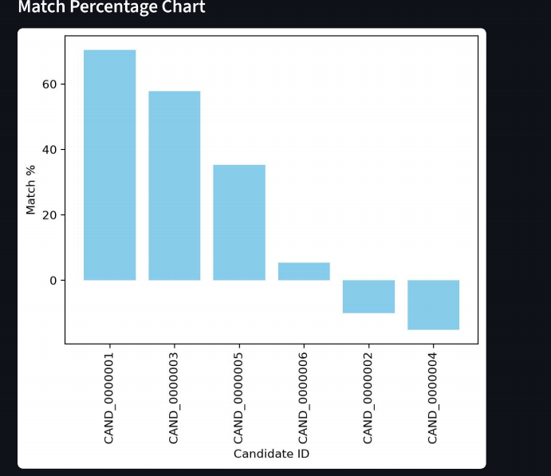
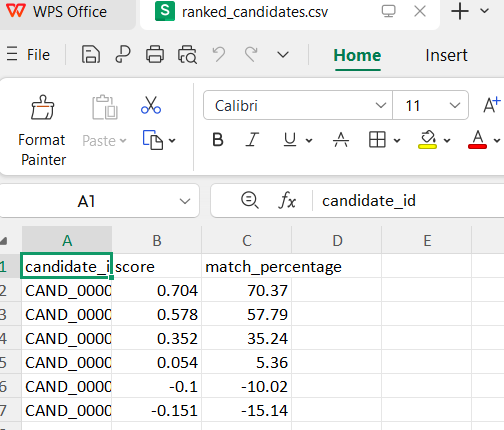

# 🚀 AI-Powered Candidate Ranking System

### INDIA.RUNS Data & AI Challenge 2026

> An AI-powered recruitment intelligence system that ranks candidates using semantic AI, skill analysis, and experience scoring instead of traditional keyword matching.

---

# 📌 Overview

Recruiting the right candidate has become increasingly difficult as organizations receive hundreds or even thousands of applications for a single job posting. Traditional Applicant Tracking Systems (ATS) primarily rely on keyword matching, often overlooking highly qualified candidates whose resumes use different terminology despite possessing the required skills.

This project introduces an **AI-Powered Candidate Ranking System** that understands the semantic meaning of job descriptions and candidate profiles, enabling recruiters to identify the best-fit candidates more accurately and efficiently.

---

# 🎯 Problem Statement

Traditional hiring systems suffer from several limitations:

- Heavy dependence on keyword matching
- Poor contextual understanding
- High manual screening effort
- Bias toward resume formatting
- Missing qualified candidates due to wording differences

Recruiters need an intelligent system capable of understanding **who actually fits a role**, rather than simply checking whether a resume contains certain keywords.

---

# 💡 Solution

Our solution leverages **Natural Language Processing (NLP)** and **Sentence Transformers** to compare the semantic meaning of job descriptions with candidate profiles.

The ranking process combines:

- Semantic Similarity
- Skill Matching
- Experience Evaluation

These scores are merged into a hybrid weighted ranking algorithm that produces an explainable and recruiter-friendly candidate ranking.

---

# ✨ Key Features

- ✅ AI-based Semantic Matching
- ✅ Intelligent Candidate Ranking
- ✅ Hybrid Weighted Scoring
- ✅ Skill Match Analysis
- ✅ Experience Evaluation
- ✅ REST API using FastAPI
- ✅ Interactive Streamlit Dashboard
- ✅ Swagger API Documentation
- ✅ CSV Export
- ✅ Visual Analytics
- ✅ Production-ready Architecture

---

# 🧠 System Architecture

```text
                    Job Description
                           │
                           ▼
                  Text Preprocessing
                           │
                           ▼
         SentenceTransformer Embedding Model
                           │
                           ▼
              Semantic Similarity Engine
                           │
        ┌──────────────────┴──────────────────┐
        │                                     │
        ▼                                     ▼
 Skill Matching Module             Experience Scoring
        │                                     │
        └──────────────────┬──────────────────┘
                           ▼
                Hybrid Weighted Ranking
                           ▼
               Candidate Ranking Engine
                           ▼
          FastAPI Backend + Streamlit Frontend
                           ▼
      Ranked Candidates + Charts + CSV Export
```

---

# ⚙️ Technology Stack

| Technology | Purpose |
|------------|---------|
| Python | Programming Language |
| FastAPI | Backend REST API |
| Streamlit | Interactive Dashboard |
| SentenceTransformers | Semantic Embeddings |
| Scikit-learn | Cosine Similarity |
| Pandas | Data Processing |
| NumPy | Numerical Computing |
| Matplotlib | Data Visualization |

---

# 📂 Project Structure

```text
india-runs-ai-ranking/

│
├── backend/
│   ├── __init__.py
│   ├── main.py
│   ├── ranking.py
│   └── models.py
│
├── data/
│   ├── job_description.txt
│   └── sample_candidates.json
│
├── sample_output/
│   └── ranked_candidates.csv
│
├── app.py
├── requirements.txt
├── README.md
└── LICENSE
```

---

# 📊 Input

The system accepts:

- Job Description
- Candidate Profiles
- Skills
- Resume Information
- Years of Experience

---

# 📤 Output

The system generates:

- Ranked Candidate List
- Semantic Similarity Score
- Skill Match Score
- Experience Score
- Final Hybrid Score
- Downloadable CSV
- Ranking Visualization

---

# 🤖 Why Hybrid AI?

Instead of relying solely on keyword matching, the ranking engine combines multiple intelligent signals.

### Semantic Understanding

Understands the meaning behind the resume rather than exact words.

Example:

Job Description

```
Looking for Backend Developer experienced with REST APIs.
```

Resume

```
Developed scalable web services using FastAPI.
```

Although the exact wording differs, semantic embeddings recognize the strong relationship.

---

### Skill Matching

Required skills are compared against candidate skills.

Example:

Required

- Python
- SQL
- FastAPI
- Machine Learning

Candidate

- Python
- FastAPI
- SQL

Produces a skill overlap score.

---

### Experience Evaluation

Experience is normalized into a numerical score.

Candidates with more relevant experience receive higher rankings without dominating semantic relevance.

---

# 🚀 Benefits

Compared to traditional ATS:

| Traditional ATS | Our AI System |
|----------------|--------------|
| Keyword Search | Semantic Understanding |
| Static Rules | AI Ranking |
| Manual Filtering | Automated Shortlisting |
| Limited Context | Context-Aware Matching |
| Low Recall | Better Talent Discovery |

---

# 🔍 Candidate Evaluation Pipeline

Every candidate passes through the following stages:

1. Resume Preprocessing
2. Semantic Embedding Generation
3. Cosine Similarity Calculation
4. Skill Extraction
5. Experience Scoring
6. Hybrid Score Calculation
7. Candidate Ranking
8. CSV Export
9. Dashboard Visualization

---

# 🚀 Installation

## 1️⃣ Clone the Repository

```bash
git clone https://github.com/reddyAnkitha/india-runs-ai-ranking.git

cd india-runs-ai-ranking
```

---

## 2️⃣ Create Virtual Environment (Recommended)

### Windows

```bash
python -m venv venv

venv\Scripts\activate
```

### Linux / macOS

```bash
python3 -m venv venv

source venv/bin/activate
```

---

## 3️⃣ Install Dependencies

```bash
pip install --upgrade pip

pip install torch --index-url https://download.pytorch.org/whl/cpu

pip install -r requirements.txt
```

---

# ▶ Running the Project

The project consists of two components:

- FastAPI Backend
- Streamlit Frontend

Both should be started separately.

---

# ⚙️ Start FastAPI Backend

Run

```bash
uvicorn backend.main:app --reload
```

Backend runs at

```
http://127.0.0.1:8000
```

---

# 📚 FastAPI Swagger Documentation

FastAPI automatically generates interactive API documentation.

Open

```
http://127.0.0.1:8000/docs
```

Features:

- Interactive API testing
- Request schema
- Response schema
- Live endpoint testing
- OpenAPI specification

This makes the backend production-ready and easy to integrate with other applications.

---

# ▶ Start Streamlit Dashboard

Open another terminal and run

```bash
streamlit run app.py
```

The dashboard launches at

```
http://localhost:8501
```

---

# 🖥️ Dashboard Features

The Streamlit interface allows recruiters to:

- Upload or paste Job Description
- View ranked candidates
- Analyze score breakdown
- Compare candidates visually
- Download ranking results as CSV

---

# 🔄 System Workflow

```
Recruiter
     │
     ▼
Enter Job Description
     │
     ▼
Generate Sentence Embeddings
     │
     ▼
Load Candidate Dataset
     │
     ▼
Calculate Semantic Similarity
     │
     ▼
Calculate Skill Match
     │
     ▼
Calculate Experience Score
     │
     ▼
Hybrid Weighted Ranking
     │
     ▼
Display Results
     │
     ▼
Download CSV
```

---

# 🧠 Ranking Methodology

Each candidate is evaluated using three independent metrics.

---

## 1️⃣ Semantic Similarity

Uses

```
SentenceTransformer
all-MiniLM-L6-v2
```

The model converts both

- Job Description
- Candidate Profile

into dense vector embeddings.

Cosine Similarity is then calculated to determine contextual relevance.

---

## 2️⃣ Skill Matching

Required skills are extracted from the Job Description.

Candidate skills are compared against the required list.

Example

Required

```
Python
SQL
FastAPI
Machine Learning
```

Candidate

```
Python
FastAPI
SQL
Docker
```

Skill overlap contributes to the final ranking score.

---

## 3️⃣ Experience Scoring

Experience is normalized based on years of relevant work.

Higher relevant experience results in a higher score while maintaining balance with semantic relevance.

---

# 📈 Hybrid Scoring Formula

```
Final Score =
0.50 × Semantic Similarity
+ 0.30 × Skill Match
+ 0.20 × Experience Score
```

Advantages of this approach:

- Reduces keyword bias
- Rewards contextual understanding
- Balances technical skills with experience
- Easily customizable for different hiring needs

---

# 🌐 REST API

## Home Endpoint

```
GET /
```

Returns project status.

---

## Candidate Ranking Endpoint

```
POST /rank
```

Ranks candidates based on the submitted Job Description.

---

## Swagger Documentation

```
GET /docs
```

Automatically generated by FastAPI.

---

# 📥 Example Request

```json
{
  "job_description": "Looking for a Python Backend Developer with FastAPI, SQL, REST APIs, and Machine Learning experience."
}
```

---

# 📤 Example Response

```json
{
  "job_title": "Python Backend Developer",
  "total_candidates": 100,
  "top_candidates": [
    {
      "rank": 1,
      "candidate_id": "C102",
      "semantic_score": 96.4,
      "skill_score": 91,
      "experience_score": 95,
      "final_score": 94.82
    },
    {
      "rank": 2,
      "candidate_id": "C145",
      "semantic_score": 91.2,
      "skill_score": 95,
      "experience_score": 90,
      "final_score": 92.36
    }
  ]
}
```

---

# 📁 CSV Export

The application automatically exports ranking results.

Example

```
sample_output/

ranked_candidates.csv
```

Example CSV

```csv
Rank,Candidate_ID,Semantic,Skill,Experience,FinalScore
1,C102,96.4,91,95,94.82
2,C145,91.2,95,90,92.36
3,C087,89.8,88,90,89.94
```

---

# 📊 Expected Output

The application generates:

- Top-ranked candidates
- Semantic similarity score
- Skill match score
- Experience score
- Final hybrid score
- Downloadable CSV report
- Interactive dashboard visualizations

---

# 🚀 Deployment

The application can be deployed using:

- Render
- Railway
- AWS EC2
- Azure App Service
- Google Cloud Run
- Docker

FastAPI serves the backend APIs while Streamlit provides the interactive user interface.

---

# 📖 API Documentation Highlights

The project includes production-ready API documentation through FastAPI.

Benefits:

- Interactive testing
- Automatic schema generation
- OpenAPI compliance
- Easy integration with frontend applications
- Developer-friendly interface

# 📊 Sample Results

After processing the candidate dataset, the system produces a ranked shortlist based on semantic relevance, skill alignment, and experience.

| Rank | Candidate ID | Semantic | Skill | Experience | Final Score |
|------|--------------|---------:|------:|-----------:|------------:|
| 1 | C102 | 96.40 | 91 | 95 | 94.82 |
| 2 | C145 | 91.20 | 95 | 90 | 92.36 |
| 3 | C087 | 89.80 | 88 | 90 | 89.94 |
| 4 | C054 | 87.50 | 86 | 88 | 87.48 |
| 5 | C201 | 84.90 | 87 | 84 | 85.87 |

---

# 📈 Dashboard Visualizations

The Streamlit dashboard provides interactive visual analytics including:

- 📊 Candidate Ranking Bar Chart
- 📈 Final Score Comparison
- 🧠 Semantic Similarity Distribution
- 💼 Skill Match Comparison
- ⭐ Top Candidate Summary
- 📄 CSV Download

---

# 📸 Screenshots

## 🖥️ Streamlit Dashboard



---

## 📊 Candidate Ranking


---

## 📈 Ranking Chart



---

## 📚 FastAPI Swagger Documentation


---

## 📄 CSV Output



---

## 📚 FastAPI Swagger Documentation

```
docs/images/swagger.png
```

---

# 🌟 Repository Highlights

✔ AI-powered Semantic Resume Matching

✔ Hybrid Candidate Ranking Algorithm

✔ FastAPI REST API

✔ Interactive Streamlit Dashboard

✔ Production-ready Swagger Documentation

✔ CSV Export Support

✔ Modular Python Codebase

✔ Easy Deployment

✔ Clean Project Architecture

---

# 🎯 Advantages

Compared to conventional Applicant Tracking Systems (ATS), our solution provides:

- Understands resume context instead of matching keywords.
- Identifies candidates with transferable skills.
- Reduces recruiter screening effort.
- Produces explainable candidate rankings.
- Supports scalable recruitment workflows.
- Easily integrates into existing HR systems.

---

# 📊 Business Impact

Our solution provides measurable benefits for recruitment teams.

| Metric | Improvement |
|---------|------------|
| Resume Screening Time | 70–90% Reduction |
| Hiring Accuracy | Improved |
| Keyword Bias | Significantly Reduced |
| Candidate Discovery | Increased |
| Recruiter Productivity | Higher |

---

# 🎯 Use Cases

The system can be applied in multiple recruitment scenarios.

- Campus Recruitment
- Enterprise Hiring
- Technical Interviews
- Lateral Hiring
- Internship Screening
- Internal Job Mobility
- HR Analytics

---

# 🔒 Scalability

The architecture has been designed to scale easily.

Future enterprise integrations include:

- PostgreSQL
- MongoDB
- Elasticsearch
- Vector Databases (Pinecone, FAISS, Chroma)
- Cloud Storage
- HR Management Systems

---

# 🚀 Future Enhancements

We plan to extend the platform with additional AI capabilities.

### Resume Processing

- PDF Resume Parsing
- DOCX Resume Parsing
- OCR Support
- Automatic Skill Extraction

### AI Features

- LLM-generated Candidate Explanations
- Candidate Fit Summary
- AI Interview Recommendation
- Resume Quality Analysis
- Missing Skill Suggestions

### Platform Features

- Recruiter Login
- Authentication
- Dashboard Analytics
- Candidate History
- Multi-language Resume Support
- Recruiter Feedback Learning

### Deployment

- Docker
- AWS
- Azure
- Google Cloud
- Kubernetes

---

# 📚 References

- Sentence Transformers
- Hugging Face Transformers
- FastAPI Documentation
- Streamlit Documentation
- Scikit-learn Documentation
- Pandas Documentation

---

# 📜 License

This project is licensed under the MIT License.

Feel free to use, modify, and distribute this project for educational and research purposes.

---

# 👩‍💻 Author

**Ankitha**

Computer Science Engineer

GitHub:

```text
https://github.com/reddyAnkitha
```

---

# 🙏 Acknowledgements

This project was developed as part of the **INDIA.RUNS Data & AI Challenge 2026**.

Special thanks to:

- INDIA.RUNS
- Hack2Skill
- FastAPI Community
- Streamlit Community
- Hugging Face
- Sentence Transformers
- Scikit-learn
- Open Source AI Community

---

# 🏆 Conclusion

The **AI-Powered Candidate Ranking System** demonstrates how modern AI techniques can transform recruitment by understanding candidate profiles beyond simple keyword matching.

By combining:

- Semantic Similarity
- Skill Matching
- Experience Evaluation

the platform delivers an intelligent, explainable, and scalable recruitment assistant capable of helping recruiters identify the most suitable candidates quickly and accurately.

The modular architecture, production-ready REST API, interactive dashboard, and extensible design make the solution suitable for both hackathon evaluation and future enterprise deployment.

---

# ⭐ Support

If you found this project useful, please consider giving it a ⭐ on GitHub.

Your support helps improve the project and encourages further development.

---

# 🏁 INDIA.RUNS Data & AI Challenge 2026

> **"Making hiring smarter through AI-powered semantic understanding, intelligent ranking, and explainable candidate evaluation."**